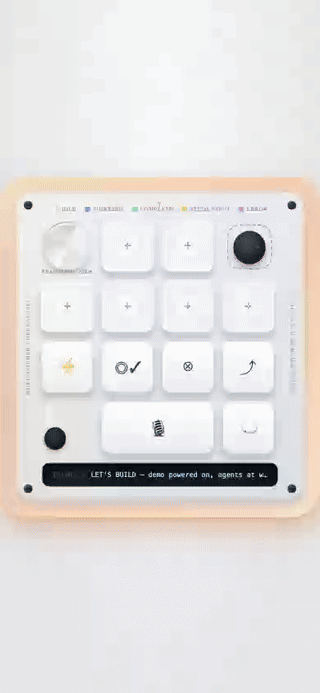
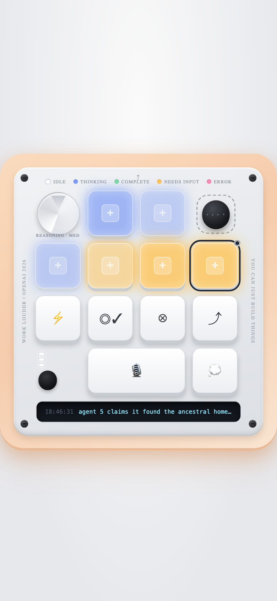
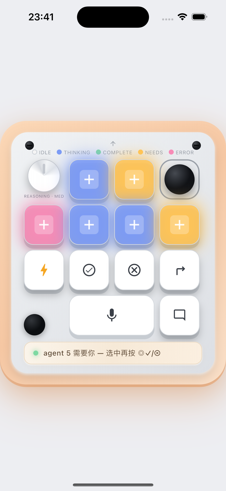

# OpenMicro — 本机 coding agent 的软件遥控器

[](https://github.com/TonyWang-hub/openmicro/actions/workflows/ci.yml)
[](https://TonyWang-hub.github.io/openmicro/)
[](LICENSE)
[](https://nodejs.org/)
[](https://flutter.dev/)
[](web/toy/manifest.json)

> 🎛️ **手机 / 网页 / 原生 App 遥控你本机的 `claude` 和 `codex`。** 6 盏灯实时反映每个 agent 会话的状态，按键把 accept / reject / 语音指令直接注入回那个真实终端——不用凑近电脑，也不用手动敲。
>
> 真机 Codex Micro 的"智能"全在 ChatGPT 桌面 App 里，硬件只是 HID 键盘 + RGB 灯；OpenMicro 用纯软件（Host 服务 + 网页 / 原生 App）复刻同样的交互，还多支持了 Claude Code。
>
> **关键词**: OpenMicro, Codex Micro, Claude Code, Codex, agent macropad, coding agent remote, AI agent 遥控, 拟物键盘, tmux, cmux, Claude Code hooks, 语音派活, PWA, Flutter, 手机遥控 agent

[English](README_en.md) | **简体中文**

> **致敬声明**：灵感来自售罄的 $230 硬件宏键盘 "Codex Micro"，但**并非其官方产品，也不隶属于 OpenAI / Work Louder，不出售任何硬件**。"Codex" 与 "Codex Micro" 为各自权利人的商标。代码内部沿用历史前缀 `cms`，与公开名称无关。

---

## 目录

- [这是什么？](#这是什么)
- [它解决什么问题](#它解决什么问题)
- [界面预览](#界面预览)
- [三端总览](#三端总览)
- [快速开始](#快速开始)
- [Docker](#docker)
- [核心概念](#核心概念)
- [能力矩阵](#能力矩阵)
- [安全](#安全)
- [常见问题](#常见问题)
- [路线图](#路线图)
- [相关 / 同源项目](#相关--同源项目)
- [引用](#引用)
- [许可证](#许可证)

---

## 这是什么？

OpenMicro 是一套**三端软件遥控器**，把你本机正在跑的每个 coding agent 会话（Claude Code / Codex）实时映射成 6 盏灯，并允许你从手机、网页或原生 App 把审批和语音指令注入回真实终端：

- **Host（Node 服务）** — 唯一真相源：接收 agent 的官方 hooks 事件，维护 6 槽状态机，把命令注入回 tmux / cmux。
- **网页端** — 免装 App，扫码或开链接即用；含桌面开发面与手机拟物玩具两套页面，支持 Demo / Live 双模式。
- **原生 App（Flutter，iOS / Android）** — 网页端体感升级：真实触感、合成机械键音、扫码配对、语音转文字派活。

> **▶︎ 在线 Demo（免安装、无后端）**：<https://TonyWang-hub.github.io/openmicro/> —— 手机 Demo 模式，用假 agent 演示灯态与审批，适合先感受一下。建议手机打开。

<p align="center">
  
  <br/>
  <em>Demo 模式：6 盏灯实时演示 agent 会话状态，按键审批、语音派活。</em>
</p>

## 它解决什么问题

同时开多个 coding agent 时，你得不停切窗口去看"哪个在等我确认、哪个卡住了、哪个跑完了"。OpenMicro 把这件事变成**一眼看灯 + 一键审批**：

- **看灯**：任何目录新开的 claude / codex 都自动占一盏灯，按项目名（cwd）标注，状态用五色实时反映——不用切窗口轮询。
- **一键审批**：点选某盏灯后，命令键把 accept / reject / 语音指令直接发回那个会话的终端。
- **随手可及**：把手机当成放在桌边的物理遥控器，或直接扫码用网页——审批不再需要回到键盘前。

## 界面预览

<table>
<tr>
<td align="center"><b>网页 Demo（浏览器 · 假 agent 演示）</b></td>
<td align="center"><b>原生 App（iOS / Android · 拟物触感）</b></td>
</tr>
<tr>
<td align="center"></td>
<td align="center"></td>
</tr>
</table>

> 顶部为动图；`docs/media/openmicro-web-demo.mp4` 是更轻量（254KB）的社交版。两图均为灯态点亮：web 是 Demo 模式假 agent 自演，App 是原生端连上 Host 后 6 槽实时反映真实会话（蓝 = 思考 / 琥珀 = 待你输入 / 粉 = 出错）。

## 三端总览

```
┌─────────────┐   HTTP hooks 转发    ┌───────────────────┐   WS 广播状态    ┌──────────────┐
│ claude/codex │ ───────────────────▶│   Host（Node）      │─────────────────▶│  网页 / App   │
│ （真实会话） │◀─────────────────── │ ingest→store→router │◀─────────────────│ 看灯/按键/语音│
└─────────────┘   tmux/cmux 注入按键  └───────────────────┘   WS 发命令       └──────────────┘
```

| 端 | 目录 | 形态 | 定位 |
|---|---|---|---|
| **Host** | `host/` | Node.js 服务（HTTP + WebSocket） | 唯一真相源：收 hooks 事件、维护 6 槽状态机、把审批 / 语音指令注入回 tmux / cmux |
| **网页版** | `web/` | 两套页面：`web/index.html`（桌面开发面，左键盘 + 右真终端 xterm.js）、`web/toy/*` + `web/m.html`（手机 1:1 拟物玩具，竖屏，Demo / Live 双模式） | 免装 App，扫码 / 开链接即用 |
| **原生 App** | `app/`（Flutter） | 安卓 / iOS 通用 | 网页版体感升级：真实触感（CoreHaptics / VibrationEffect）、合成机械键音、扫码配对、语音转文字派活；复用同一个 Host，Host 一行不改 |

详细架构、模块清单、关键设计决策见 **[docs/ARCHITECTURE.md](docs/ARCHITECTURE.md)**。

## 快速开始

### 1. 起 Host

```bash
npm install
npm start
```

或一键脚本（检查 node / jq / curl、按需加载 `.env`、缺 `node_modules` 才装依赖、启动并打印配对提示）：

```bash
cp .env.example .env   # 可选，不改就用内置默认值
bash scripts/start.sh
```

浏览器打开 `http://127.0.0.1:7788`（桌面开发面，左键盘 + 右真终端）。Host 默认只监听 `127.0.0.1`；手机要连必须 `CMS_HOST=0.0.0.0` 重启（见 [docs/DEPLOY.md](docs/DEPLOY.md)）。

### 2. 装全局 hooks（自动跟踪所有 claude / codex 会话）

装一次，之后**任何目录**新开的 claude / codex 都自动占一盏灯、按项目名（cwd）标注、超 6 个 LRU 回收——不用再给每个项目手配 sessionKey。安装步骤（含 hook JSON 片段、卸载方法）见 **[docs/DEPLOY.md](docs/DEPLOY.md#全局-hooks-安装)**。

### 3. 手机开网页，或用 App 连接

```bash
# Demo 模式（零配置，6 个假 agent 演戏 + 音效震动）：
#   http://127.0.0.1:7788/m
# Live 模式（灯接你的真 agent，命令行注入）：
#   CMS_HOST=0.0.0.0 CMS_TOKEN=你的token npm start
#   电脑打开 http://<局域网IP>:7788/pair 出二维码 → 手机扫码进
```

原生 App（Flutter）：`cd app && flutter run`，进入后粘贴 `/pair` 页给出的配对链接，或直接扫码。构建 / 真机细节见 [docs/DEPLOY.md](docs/DEPLOY.md#app-构建)。

## Docker

容器版 Host 只适合"只看灯监控、不需要远程按键"的场景（比如放一台常驻小机器上做纯展示）。

```bash
cp .env.example .env   # 至少固定一个 CMS_TOKEN
docker compose up --build
```

局域网访问：`http://<宿主机IP>:7788/m?token=<CMS_TOKEN>&live=1`。

> ⚠️ **边界：容器版只能监控，不能远程按键注入。** accept / reject / 语音派活靠 `tmux send-keys` 或 cmux CLI 把按键发回真实会话的终端，而那个 tmux 会话 / cmux 进程本来就跑在**宿主机**上——容器里既没有宿主机的 tmux socket，也接触不到宿主机的 cmux 进程。灯效（hooks 事件点亮 6 槽状态机）在容器里完全正常，但点 accept / reject 或语音派活会得到"不在 tmux / cmux，无法远程按键"的提示。需要完整能力，请用「快速开始」里的 `scripts/start.sh` 直接在宿主机跑 Host。详见 [Dockerfile](Dockerfile) 顶部注释。

## 核心概念

- **自动认领槽（session_id 自动分配）**：Claude Code / Codex 的 hook 事件自带 `session_id`（会话唯一 UUID）和 `cwd`。Host 首次见到某个 `session_id` 就自动占用一个空槽（`slotId` 0–5）；6 槽占满后按 LRU 淘汰最久未活跃的空闲槽（`needs_input` 受保护，尽量不淘汰）。不再需要每个项目手动绑定 `sessionKey`。
- **cmux / tmux 注入**：灯效永远只由官方 hooks / notify 事件驱动（**绝不**从终端文本推断）；而"远程按键"（accept / reject / 语音派活）需要把按键真的发回那个会话的终端——这要求该会话跑在 **tmux**（`tmux send-keys`）或 **cmux**（GUI 多路终端，`cmux send` / `send-key --surface`）里。两者都不在就只能看灯，按键会提示"无法远程按键"。两者都在时优先 cmux（真实 TUI 所在处）。
- **显式聚焦安全**：命令键（◎✓ accept / ⊗ reject / ⚡ quick / 🎙 语音）只作用于用户**显式点选**的那盏 Agent 灯，绝不自动挑选——防止误注入到错误的会话或对话窗口。完整契约见 [docs/COMMANDS.md](docs/COMMANDS.md)。

## 能力矩阵

| 能力 | 前提条件 | 说明 |
|---|---|---|
| **监控（灯 + LCD 文案）** | 任何 claude / codex 会话，装了全局 hooks 即可 | session_id 自动认领槽、cwd 标注项目名，这是核心价值，与是否在 tmux / cmux 无关 |
| **手机 / App 远程按 ◎✓ / ⊗（accept / reject）** | 该会话跑在 **tmux 或 cmux** 里 | 注入按键需要一个真实的 pane / surface 作为目标；非 tmux / cmux 会话只能看灯，按键无效（会提示，不报错） |
| **🎙 语音派活（把说的话打进终端）** | 同上（tmux / cmux）+ 浏览器 / App 支持语音识别 | 网页走 Web Speech API（`webkitSpeechRecognition`，不支持则降级提示用键盘）；App 走 `speech_to_text` |
| **💭 新建会话 / ⤴ 项目内分叉** | Host 能调用 `tmux new-session` 或 `cmux workspace create` | 新会话自动经 hooks 上灯，无需手动绑定 |

WS 命令契约（各 action 的载荷 / 行为 / 失败路径）见 **[docs/COMMANDS.md](docs/COMMANDS.md)**。

## 安全

- 🔒 **默认只监听 loopback** — Host 默认绑 `127.0.0.1`，手机接入需显式 `CMS_HOST=0.0.0.0` + token。
- 🎟️ **配对 token** — Live 模式必须带 token；局域网子资源用 cookie 鉴权。可选开启 Origin 校验 + 每 IP 限流。
- 📡 **全本机、无上云** — 数据不经任何第三方服务器；灯效只由本机 agent 的 hooks 驱动。
- 👁️ **只信任会话自报的注入目标** — `tmuxTarget` / `cmuxTarget` 完全来自该会话自己的转发脚本，Host 不接受外部指定的注入目标，杜绝命令误发到别的窗口。

发现漏洞请走 GitHub 私有安全公告，详见 [SECURITY.md](SECURITY.md)。

## 常见问题

**问：需要买 Codex Micro 硬件吗？**
答：不需要。OpenMicro 是纯软件，跑在你已有的电脑 + 手机 / 浏览器上。

**问：和真机 Codex Micro 什么关系？**
答：只是**软件复刻它的交互**（看灯 + 审批 + 语音派活），并非官方产品，也不隶属 OpenAI / Work Louder，不出售硬件。

**问：支持哪些 agent？**
答：Claude Code 与 Codex，通过它们的官方 hooks / notify 事件接入。灯态**绝不**从屏幕文字推断，只由官方事件驱动。

**问：手机一定能远程按键吗？**
答：看灯任何情况都行；但"远程按 accept / reject / 语音"需要该会话跑在 tmux 或 cmux 里（注入按键需要真实终端目标）。非 tmux / cmux 会话只能看灯。

**问：数据会上云吗？**
答：不会。Host 默认只监听本机 loopback，全部数据在本机流转，不经任何第三方服务器。

**问：Demo 模式和 Live 模式的区别？**
答：Demo 是零配置的假 agent 演示（扫码即玩）；Live 接你本机真实的 agent 会话，需要 token 且要求会话在 tmux / cmux 才能注入按键。

## 路线图

### 已完成 ✅
- Host / 网页 / 原生 App 三端打通，复用同一 Host 契约
- 全局 hooks 自动分槽（session_id 认领 + cwd 标注 + LRU 回收）
- cmux / tmux 按键注入 adapter，显式聚焦防误注入
- 中英双语 i18n（网页 + App）
- 二期：语音派活、扫码配对、新会话 / 项目内分叉的真实注入（Host 侧接线完成）

### 进行中 / 已知差异 🟡
- App 合成机械键音的 `_play` 目前是占位实现（音频合成已完成，播放接线待补）
- Codex app-server 增强路径默认无真实 transport（需调用方注入）
- 真机触感 / 语音 / 扫码的端到端验收（模拟器已通，待真机）

### 计划 ⬜
- 上架 App 商店前的 bundle id 与图标定名
- 更多 agent / 事件源适配

完整变更记录见 [CHANGELOG.md](CHANGELOG.md)。

## 相关 / 同源项目

- **定位判断**：真机 Codex Micro 的"智能"全在 ChatGPT 桌面 App 里，硬件只是 HID 键盘 + RGB 灯——因此纯软件（Host + 网页 / App）足以复刻同样的交互。
- **开源同类可参考**：amux、CloudCLI UI、agent-dashboard、Tactic Remote 等。

## 引用

如果在研究或项目中用到 OpenMicro：

```bibtex
@software{openmicro,
  title  = {OpenMicro: A Software Remote for Local Coding Agents},
  year   = {2026},
  url    = {https://github.com/TonyWang-hub/openmicro}
}
```

## 许可证

MIT — 详见 [LICENSE](LICENSE)。参与贡献见 [CONTRIBUTING.md](CONTRIBUTING.md)，行为准则见 [CODE_OF_CONDUCT.md](CODE_OF_CONDUCT.md)。
